 PhotoMunger
===

Introduction
---
PhotoMunger is a tool that applies batch processing to a set of photos. I wrote PhotoMunger to solve two specific problems I had: 1) reducing the size of images, but only when down-scaling will not appreciably lose detail, and 2) enhancing document "scans" made with a point-and-shoot camera in lieu of a proper scanner.

Please note that as a result of this focused purpose there are a number of things that PhotoMunger *won't* do, including most of the various filters found in programs like [GIMP][1] or [Photoshop][2].

PhotoMunger is open source and is licensed under the GPL (GNU Public License). The source can be found on GitHub [here][5].

Outline of Typical Workflow
---
PhotoMunger processes all photos in one directory. The program can be launched in two ways. First, the directory to process can be specified on the command line: `PhotoMunger.exe <path>`. Or, if the program is launched with no arguments, it will prompt for the directory to process. Navigate *into* the directory to process and press *Open*.

The program then presents a dialog with various processing options. Which options to select depends on the task at hand. See sections later in this document for information about how to use these settings.

After the options dialog is accepted by pressing *OK*, the main window appears and the program begins analysis of the photos. Depending on the selected options, analysis may take more or less time.

There are 5 primary areas in the display:

1. A list of all items in the directory. The text of each entry is gray until it has been processed, at which point it turns black. ~~Struck through~~ text indicates that the file was not recognized as a supported image type (in general, only the *JPEG/EXIF* format is supported). Images and options can be selected by clicking on the appropriate row or using the cursor keys to navigate the active cell to a different row or column. If the active cell contains a check box, the space bar will toggle between checked and unchecked. There are also a couple of options for easy access:
	- *Shrink*: when checked, causes the file to be down-scaled by the specified ratio (the default is 2, which cuts both the width and height in half, resulting an an image that is approximately one-quarter the size of the original).
	- *Delete*: when checked, the file will be omitted from the final generated output (after *Apply* is pressed).
2. A primary display of the current image. This rendition may or may not show annotations depending on options enabled on the toolbar.
3. A toolbar for enabling display options and performing certain transformations on the image.
4. A side-by-side display of the portion of the image under the mouse, zoomed in to full scale. The upper frame shows the original image and the lower frame shows the image after it has been *shrunk* by the shrink ratio (default is 2) and then *expanded* to the original size by a high-quality resize algorithm. This area can be used to inspect parts of the image to determine how much quality might be lost given the proposed transformation.
5. An image status area. Some basic statistics are shown here, including the width and height of the original image, the width and height of the image after cropping and down-scaling is applied, the original file size and estimated final file size for the image, check boxes to enable specific transformations, and an area where messages may be displayed if an analysis pass for one of the automatic transformations was unable to determine how to process the image.

Typically, one will inspect all of the images to determine if the automatic transformations are acceptable. If automatic detection did not work as desired, specific changes can be made to an image to improve the result.

After image transformations have been checked and possibly modified, the output is generated by pressing *Apply* on the toolbar. If this is the first time a directory has been processed, a backup of all files is made. The files are copied to a directory in the same location with same name, but with `-original` appended. Each image is then processed and the resulting output stored in the selected directory.

The program saves a `Settings.xml` file in the selected directory (or in the backup directory, if it exists) containing the transformation settings and user interface options for the photo collection so that when the program is closed and reopened the options and per-image transformations will be remembered.

Workflow 1: Reducing Image Size
---
To work on image size reduction for a photo collection, accept the defaults in the options dialog by pressing *OK*. The main window will appear and the program will begin analysis of the photos.

By default, the program displays the result of an analysis that identifies regions of an image that contain a high degree of detail that would be lost if the image is *shrunk* (down-scaled) by a factor of 2. These areas are highlighted by a mesh of yellow boxes. The computation is tuned to detect the degree of loss that a typical person might notice, but it is approximate. For important images, move the mouse over critical areas and use the side-by-side inspection panel to see how much detail would be lost.

In this example, the left panel shows the yellow mesh identifying an automatically-detected area of high detail and the right panel shows the side-by-side zoomed-in view showing the loss of fine detail should the image be shrunk.

Cropping
---
PhotoMunger supports lossless JPEG cropping via [`jpegtran.exe`][3]. To crop an image, first enable the cropping tool by making sure the crop button is enabled on the toolbar:

Once the crop tool is enabled, clicking and dragging anywhere in the image will create a crop rectangle. The portion of the image inside the rectangle will be retained and that outside will be discarded. An existing crop rectangle can be modified by clicking and dragging on the pads at the corners or in the middle of each side of the rectangle. The crop rectangle can be moved without changing it's side by clicking and dragging on the pad in the rectangle's center.

The crop region can be cleared by clicking the clear crop button:
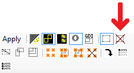

###Aspect ratio:

The aspect ratio of the crop rectangle can be constrained. By default, the aspect ratio is made to match the aspect ratio of the overall image.

To flip the aspect ratio relative to the overall image's aspect ratio, select the flip button. The aspect ratio remains the same, but for *landscape*-oriented images the crop rectangle will be *portrait*-oriented, and vice versa.

To select a specific aspect ratio (for example, for targeting a specific shape for making prints), click the preset/custom aspect ratio button to open a dialog allowing the aspect ratio to be chosen. In addition to common print/page shapes it is possible to enter the width and height for a custom aspect ratio.

#**TODO: rotation; setting shrink in file list**

Workflow 2: Enhancing Images "Scanned" via Point-and-Shoot Camera
---

In lieu of a scanner, one might use a point-and-shoot camera to photograph pages of a document. It can be quick, but the quality of the images is usually well below that of scans made with a document scanner since cameras are designed for taking photographs rather than scanning printed pages and therefore make processing decisions that are inappropriate for print documents. Workflow 2 will demonstrate how to correct the various problems in a photographed document.

Here is our initial document (click [here][6] for the full-sized sample file):

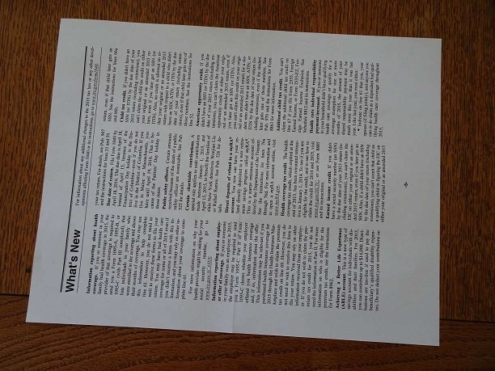

This tutorial will walk through enabling processing options one by one. Note that once the program is running it is not necessary to quit and restart the program to get back to the global options dialog. Instead, select the global options button on the toolbar:

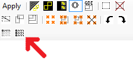

After changes to the dialog are accepted by pressing *OK*, the program will reanalyze the images and display the updated results.

###1. Bulk rotation

If all images were photographed with the same incorrect orientation, it can be fixed for all images at one time by setting the desired degree of clockwise rotation in the global options dialog:

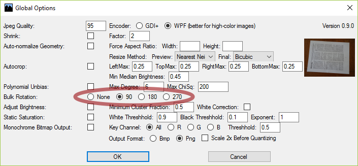

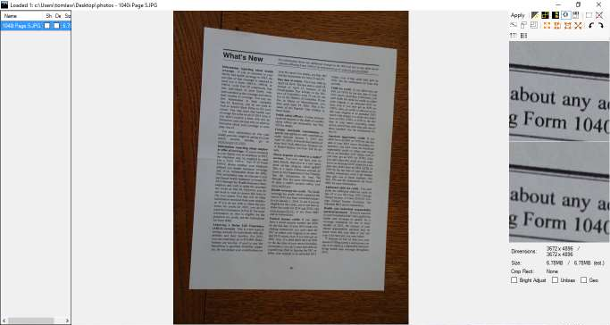

###2. Geometry correction
Photographed documents are often geometrically skewed because it is difficult to achieve perfect alignment with a hand-held camera. PhotoMunger will attempt to detect and correct the geometry when the following processing option is enabled in the options dialog:

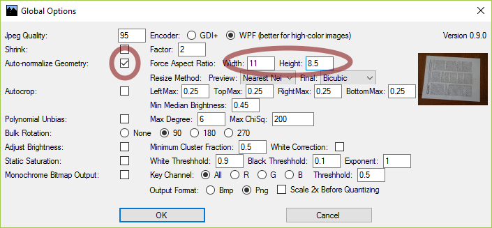

If the measurements of all pages are the same and are known, the width and height can be specified as the desired aspect ratio. Otherwise the analysis will determine an aspect ratio that is approximate.

The page with corrected geometry is displayed in the viewer pane:

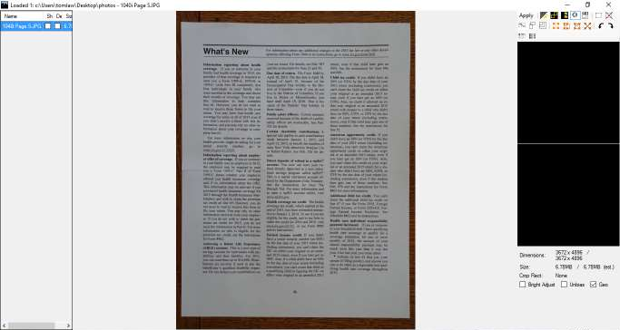

If the geometry is not detected correctly it can be manually adjusted by the following steps.

- Enter the geometry adjustment mode.

The main view panel will now display the original image with edge guides.

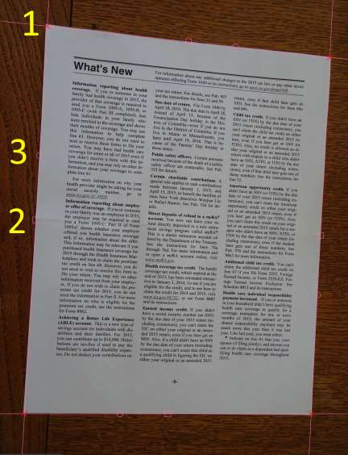

- Adjust the edges to match the page. The corners (1) can be dragged to appropriate locations. The line position can be shifted by dragging the rectangular widget shown at (2). Finally, the angle of the line change changed by dragging the circular widget shown at (3).

- Exit the geometry adjustment mode by pressing the same button used to enter it. After a couple of seconds the display will be updated with the new geometry adjustment.

###3. Removing borders

The auto-crop function can be used to find a crop rectangle that removes the surface under the page while retaining the page itself:

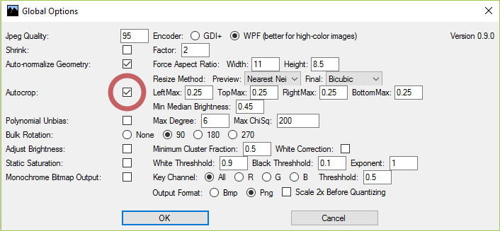

After reanalysis, a crop rectangle will appear around the page.

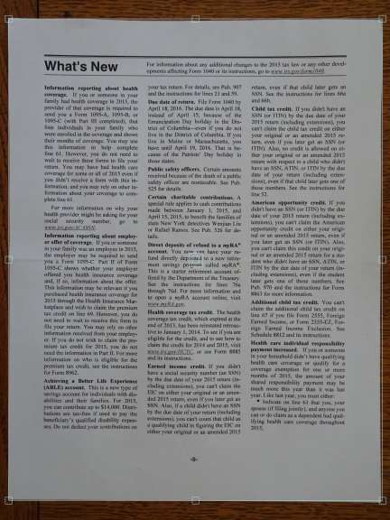

If auto-crop generates an incorrect rectangle, it can be adjusted by entering crop mode from the toolbar and moving the edges of the rectangle.

###4. Improving contrast and whiteness

Most cameras center the distribution of intensity (brightness) around 50%, which is much too dark for scanned documents. To automatically correct the brightness and contrast of all images, enable the *Bright Adjust* setting in the global options. There is also an option to remove a color bias from the page background.

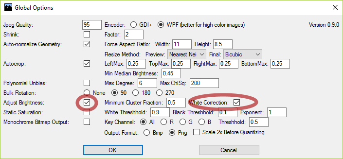

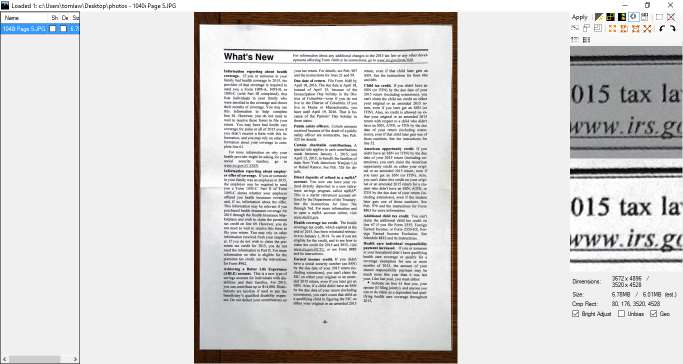

###5. Flattening uneven lighting

The displayed page from the previous step shows a noticable darkening towards one corner. Uneven lighting is a common problem with photographed documents. To try to correct uneven lighting, enable the *Unbias* processor.

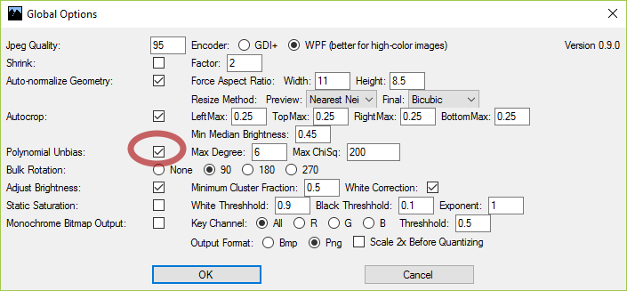

###6. Oversaturating

In some cases, light shading can be removed by oversaturating the bright end of the image, and darkness of text can be improved by oversaturating on the dark end. To do this, enable the *Static Saturation* option. The white threshhold determines what brightness value will now become 1 (maximum brightness). The black threshhold determines what brightness value will now become 0 (minimum brightness, or black). The exponent can apply a curve to the distribution of brightness: 1 applies no curve, greater than 1 brightens midtones, less than 1 darkens midtones.

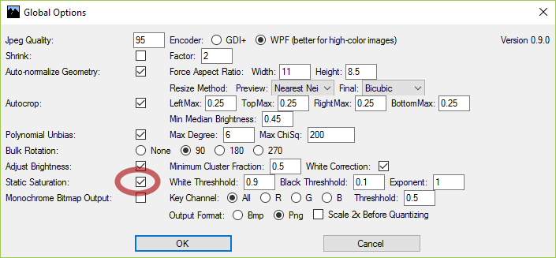

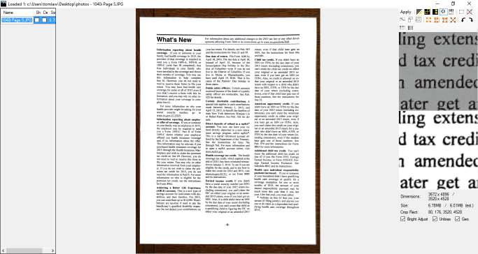

###7. Converting to black and white

In some cases it may be desirable to convert the image to black-and-white, stored as one bit per pixel. When stored in PNG format in this way, scanned image files are often much smaller than the equivalent JPEG file. They are also more suitable to printing on a black-and-white printer, if called for. To convert to black-and-white image, enable *Monochrome Bitmap Output*.

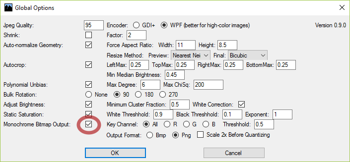

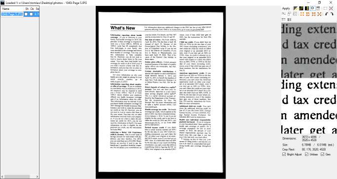

###8. Generate

Press *Apply* on the toolbar to generate the final output image.

###Final notes

Although this tutorial walked through each image processing step separately, usually the settings would be chosen all at once based on the specific condition of the photograph collection. If the results are unsatisfactory, it might be necessary to tweak certain threshholds or other settings. Fortunately, most images in a batch will tend to have the same defects and biases, allowing batch processing with global parameters to do a good job on all of the images.

---
[1]: http://www.gimp.org/
[2]: http://www.adobe.com/products/photoshop.html
[3]: http://jpegclub.org/
[4]: https://stackedit.io/editor
[5]: https://github.com/programmatom/PhotoMunger
[6]: SampleScanFullSize.JPG

Last updated September 2016. Authored using [stackedit][2].

